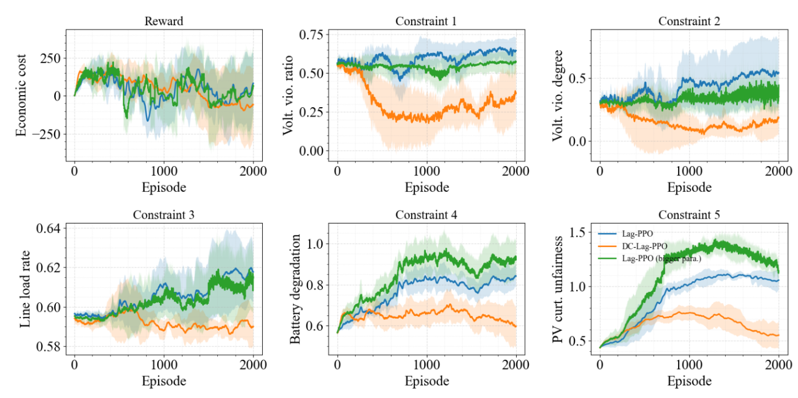
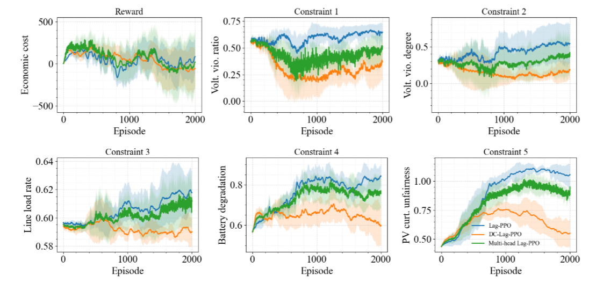
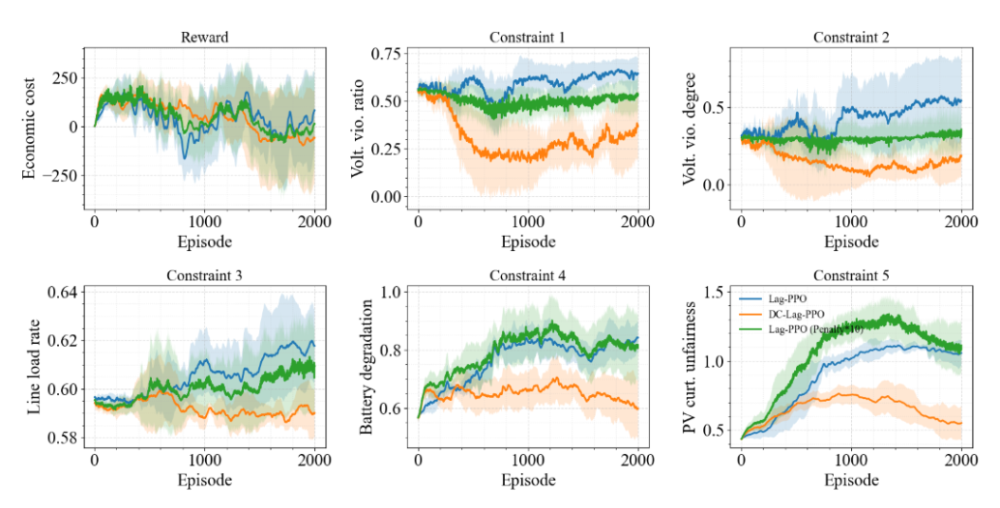
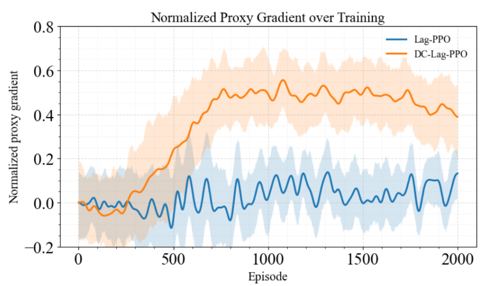
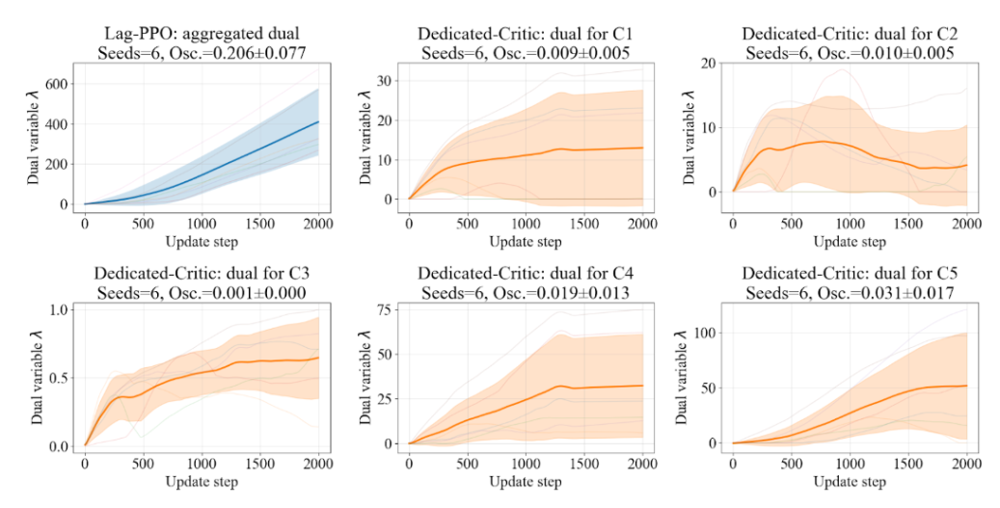

  <strong>Figure 1: Longer trainning run of Figure 3</strong> 
  

  <strong>Figure 2: EVCS(Figure 36)</strong> 
  

  <strong>Figure 3: parameter-matched comparison</strong> 
  

  <strong>Figure 4: shared-trunk multi-head ablation</strong> 
  

  <strong>Figure 5: stronger constraint-scaling baseline</strong> 
  

  <strong>Figure 6: proxy gradient alignment </strong> 
  

  <strong>Figure 7: dual oscillation magnitude</strong> 
  

